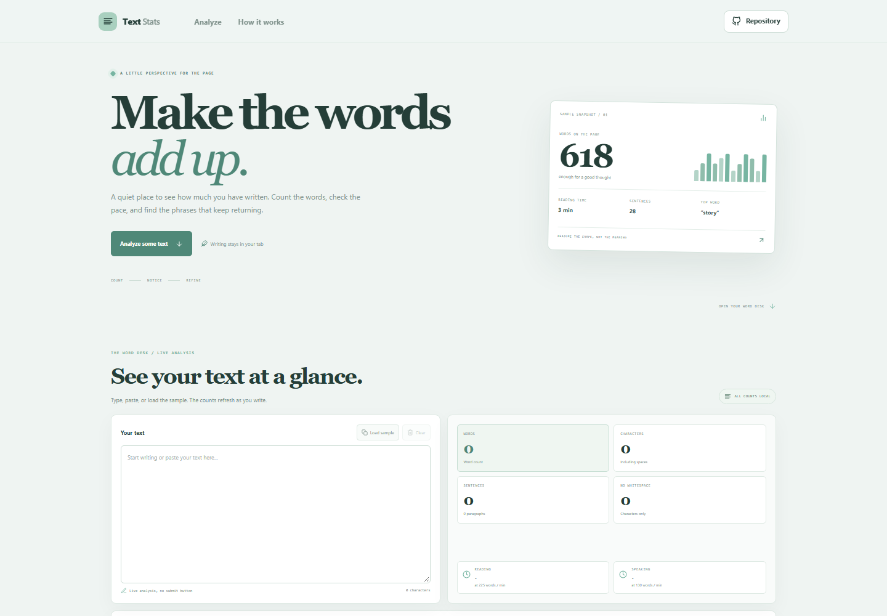



# Text Statistics Tool

Review a draft's word and character counts, sentence and paragraph totals, estimated reading and speaking time, average word length, and frequently used words as you write.

**Live app:** [https://a2rp.github.io/text-statistics-tool/](https://a2rp.github.io/text-statistics-tool/)

## Features

- Updates counts as text is typed, pasted, loaded from the sample, or cleared.
- Counts words, Unicode characters, non-whitespace characters, lines, sentences, and paragraphs.
- Estimates reading time at 225 words per minute and speaking time at 130 words per minute.
- Shows average word length and the six most frequent non-connector words.
- Runs locally in the browser; there is no upload or save action.
- Responsive layout, keyboard-accessible controls, and reduced-motion support.

## Count rules

- A word is a group of Unicode letters or numbers. Apostrophes inside words stay together; hyphenated parts count separately.
- Characters count Unicode code points, including spaces and line breaks. The separate no-whitespace count removes all whitespace.
- Sentences are estimated from sentence punctuation. Paragraphs are blocks separated by one or more blank lines.
- Reading and speaking times are rounded up to whole minutes. They are broad estimates, not a promise of actual reading speed.
- Frequent-word ranking skips common connector words and words shorter than three characters.

## Use the tool

1. Type or paste text into the editor, or choose Load sample to explore the counters.
2. Review the live statistics and repeated-word list.
3. Clear the editor when you are finished.

## Privacy and limits

Analysis runs in the browser tab. The text is not uploaded or persisted by this project. Refreshing the page clears the editor.

Text segmentation and timing are general estimates. Sentence boundaries, word forms, and useful stop words differ by language, so the frequency list is most useful for text written in languages that separate words with spaces.

## Development

Requirements: Node.js and npm.

    npm install
    npm run dev

Run checks and create a production build:

    npm test
    npm run lint
    npm run build

Deploy to GitHub Pages:

    npm run deploy

## Future improvements

- Add export options for a plain-text analysis report.
- Support language-specific word segmentation and stop-word lists.
- Let writers set a personal reading or speaking pace.

## Links

- Portfolio: [https://www.ashishranjan.net](https://www.ashishranjan.net)
- GitHub: [https://github.com/a2rp](https://github.com/a2rp)
- CodePen: [https://codepen.io/ash1198](https://codepen.io/ash1198)
- LinkedIn: [https://www.linkedin.com/in/aashishranjan](https://www.linkedin.com/in/aashishranjan)
- Facebook: [https://www.facebook.com/theash.ashish/](https://www.facebook.com/theash.ashish/)
- YouTube: [https://www.youtube.com/@ashishranjan-ashz?sub_confirmation=1](https://www.youtube.com/@ashishranjan-ashz?sub_confirmation=1)
- Email: [mailto:ash.ranjan09@gmail.com](mailto:ash.ranjan09@gmail.com)

## Support

- Support: [https://a2rp-donation-page.netlify.app/](https://a2rp-donation-page.netlify.app/)
- Buy Me a Coffee: [https://buymeacoffee.com/ashishranjan](https://buymeacoffee.com/ashishranjan)
- Patreon: [https://www.patreon.com/ashishranjan](https://www.patreon.com/ashishranjan)
